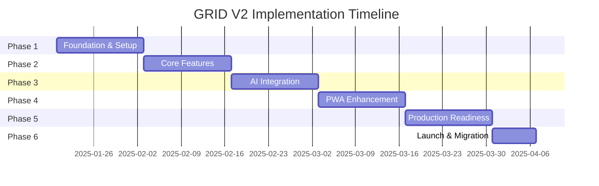

# GRID V2 Documentation

## 📋 Quick Links

### Planning Documents
- [**Executive Summary**](./plans/rewrite/executive-summary.md) - High-level overview for stakeholders
- [**Comprehensive Rewrite Plan**](./plans/rewrite/README.md) - Detailed technical plan
- [**V1 to V2 Migration Guide**](./migration/v1-to-v2-guide.md) - Step-by-step migration instructions

### Architecture Documents  
- [**GCP Backend Architecture**](./architecture/gcp-backend.md) - Infrastructure and deployment details
- PWA Implementation Guide (Coming Soon)
- API Documentation (Coming Soon)

## 🚨 Critical Issues Found in V1

### Security Vulnerabilities (CRITICAL)
1. **No Authentication System** - All APIs publicly accessible
2. **In-Memory Data Storage** - Data lost on restart
3. **No Input Validation** - SQL injection & XSS vulnerabilities
4. **Exposed Secrets** - API keys in code
5. **No Rate Limiting** - DDoS vulnerable

### Performance Issues (HIGH)
1. **No Caching** - Expensive repeated API calls
2. **Poor Database Design** - No indexes or optimization
3. **Memory Leaks** - In-memory storage grows unbounded
4. **No Connection Pooling** - Database connection exhaustion
5. **Synchronous Blocking** - Poor scalability

### Code Quality Issues (HIGH)
1. **Zero Test Coverage** - No tests of any kind
2. **Poor Error Handling** - Errors swallowed or exposed
3. **TypeScript Any Types** - No type safety
4. **No Documentation** - Difficult to maintain
5. **No Monitoring** - Blind to issues

## ✅ V2 Solutions

### Security Enhancements
- JWT + OAuth2 authentication
- Multi-factor authentication (MFA)
- Row-level security in database
- API rate limiting
- Automated security scanning

### Performance Improvements
- Redis caching layer
- Database query optimization
- Connection pooling
- Async/await patterns
- CDN for static assets

### Code Quality
- 80% test coverage minimum
- Comprehensive error handling
- Full TypeScript typing
- API documentation
- Real-time monitoring

## 📅 Timeline



## 💰 Budget

### Development Costs
- Team: 5-6 developers
- Duration: 11 weeks
- Estimated: $150,000 - $200,000

### Monthly Operating Costs
- Infrastructure: $650/month (1000 users)
- Scales to: $0.65 per user
- Includes: Compute, Database, AI, CDN

## 🏗️ Architecture Overview

### Frontend (PWA)
```
Next.js 14 (App Router)
    ├── React 18
    ├── TypeScript
    ├── Tailwind CSS
    ├── Service Workers
    └── Push Notifications
```

### Backend (GCP)
```
Cloud Load Balancer
    ├── API Gateway (Apigee)
    ├── Cloud Run Services
    │   ├── Auth Service
    │   ├── Core API Service
    │   └── AI Service
    ├── Cloud SQL (PostgreSQL)
    ├── Redis (Memorystore)
    └── Vertex AI (Vector Search)
```

### DevOps
```
GitHub Actions
    ├── Automated Testing
    ├── Security Scanning
    ├── Docker Build
    ├── Cloud Run Deploy
    └── Monitoring Setup
```

## 🚀 Getting Started

### For Developers

1. **Review Documentation**
   - Read the [Comprehensive Plan](./plans/rewrite/README.md)
   - Understand the [Architecture](./architecture/gcp-backend.md)
   - Follow the [Migration Guide](./migration/v1-to-v2-guide.md)

2. **Setup Development Environment**
   ```bash
   # Install dependencies
   npm install
   
   # Setup GCP credentials
   gcloud auth login
   gcloud config set project grid-platform-v2
   
   # Initialize Terraform
   cd infrastructure/terraform
   terraform init
   ```

3. **Start Development**
   ```bash
   # Run local services
   docker-compose up
   
   # Start development server
   npm run dev
   ```

### For Stakeholders

1. Read the [Executive Summary](./plans/rewrite/executive-summary.md)
2. Review timeline and budget
3. Approve resources and timeline
4. Monitor weekly progress reports

## 📊 Success Metrics

### Technical KPIs
- ✅ Page load < 3 seconds
- ✅ API response < 200ms (P95)
- ✅ 99.9% uptime
- ✅ Zero critical vulnerabilities
- ✅ 80% test coverage

### Business KPIs
- ✅ User activation > 60%
- ✅ Daily active users +10% MoM
- ✅ Support tickets < 5%
- ✅ AI cost < $0.50/user/month
- ✅ App rating > 4.5 stars

## 🆘 Support

### Development Team
- **Tech Lead**: Architecture & coordination
- **Backend Team**: API & database
- **Frontend Team**: PWA & UI
- **DevOps**: Infrastructure & deployment
- **QA**: Testing & quality

### Resources
- [API Documentation](./api/README.md) (Coming Soon)
- [Deployment Guide](./deployment/README.md) (Coming Soon)
- [Troubleshooting](./troubleshooting/README.md) (Coming Soon)

## 📝 Document Status

| Document | Status | Last Updated |
|----------|--------|--------------|
| Executive Summary | ✅ Complete | Jan 2025 |
| Rewrite Plan | ✅ Complete | Jan 2025 |
| GCP Architecture | ✅ Complete | Jan 2025 |
| Migration Guide | ✅ Complete | Jan 2025 |
| API Documentation | 🚧 Pending | - |
| Deployment Guide | 🚧 Pending | - |
| Testing Strategy | 🚧 Pending | - |

## 🔄 Version History

- **v1.0** (Jan 2025) - Initial documentation release
- **v1.1** (Coming) - API documentation added
- **v1.2** (Coming) - Deployment procedures added

## Structure

- `plans/` - Project planning and rewrite documentation
- `architecture/` - Technical architecture documents
- `migration/` - Migration guides and procedures
- `standards/` - Development standards and protocols
- `api/` - API documentation (Coming Soon)
- `deployment/` - Deployment procedures (Coming Soon)

## Guidelines

- All documentation must be in this /docs directory
- No separate docs directories in subdirectories
- Follow the Diátaxis framework for documentation

---

**Questions?** Contact the Tech Lead or review the [FAQ](./faq.md) (Coming Soon)

**Ready to Start?** The team is prepared to begin implementation immediately upon approval.
