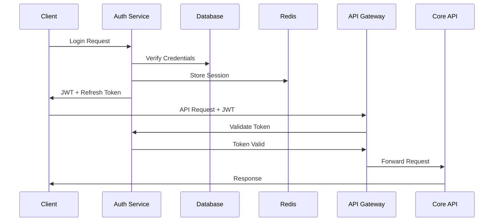

# GRID Platform V2 Rewrite Plan

## Executive Summary

This document outlines the comprehensive plan to transform the GRID v1 prototype into a production-grade Progressive Web Application (PWA) with a scalable Google Cloud Platform (GCP) backend. The rewrite addresses critical security vulnerabilities, performance bottlenecks, and architectural limitations identified in the v1 codebase.

### Key Objectives
- Transform into a production-ready PWA with offline capabilities
- Implement enterprise-grade security and authentication
- Build scalable GCP backend infrastructure
- Achieve 100% test coverage for critical paths
- Enable real-time collaboration features
- Optimize for performance (sub-3s initial load, 100 Lighthouse score)

### Critical Issues Being Addressed
1. **Security**: Complete lack of authentication and authorization
2. **Data Loss**: In-memory storage causing data loss on restart
3. **Scalability**: No caching, poor database design, inefficient API usage
4. **Quality**: Zero test coverage, poor error handling
5. **Production Readiness**: No monitoring, logging, or deployment infrastructure

## Current State Analysis

### V1 Architecture Overview
```
┌─────────────┐     ┌─────────────┐     ┌─────────────┐
│   Client    │────▶│   Server    │────▶│  Database   │
│   (React)   │     │  (Express)  │     │ (PostgreSQL)│
└─────────────┘     └─────────────┘     └─────────────┘
                           │
                           ▼
                    ┌─────────────┐
                    │  OpenAI API │
                    └─────────────┘
```

### Critical Vulnerabilities Identified

#### Security (Priority: CRITICAL)
- No authentication system despite user schema
- All API endpoints publicly accessible
- No input validation or sanitization
- Direct exposure of error details
- Vulnerable to prompt injection attacks
- No rate limiting or DDoS protection

#### Data Integrity (Priority: CRITICAL)
- In-memory storage for production data
- No database transaction management
- Missing foreign key constraints
- No data validation at database level
- No backup or recovery strategy

#### Performance (Priority: HIGH)
- Inefficient OpenAI API usage (no caching)
- Poor database query optimization
- No connection pooling configuration
- Large bundle size (no code splitting)
- Synchronous blocking operations

#### Code Quality (Priority: HIGH)
- Zero test coverage
- Inconsistent error handling
- TypeScript `any` types throughout
- No logging strategy
- Missing documentation

## Target Architecture - V2

### High-Level Architecture
```
┌─────────────────────────────────────────────────────────────┐
│                        CDN (Cloudflare)                      │
└─────────────────────────────────────────────────────────────┘
                               │
┌─────────────────────────────────────────────────────────────┐
│                    GCP Cloud Load Balancer                   │
└─────────────────────────────────────────────────────────────┘
         │                     │                     │
┌─────────────┐       ┌─────────────┐      ┌─────────────┐
│  PWA Static │       │   API       │      │  WebSocket  │
│   (Cloud    │       │  Gateway    │      │   Server    │
│   Storage)  │       │  (Apigee)   │      │  (Cloud Run)│
└─────────────┘       └─────────────┘      └─────────────┘
                              │
         ┌────────────────────┼────────────────────┐
         │                    │                    │
┌─────────────┐      ┌─────────────┐     ┌─────────────┐
│   Auth      │      │   Core API  │     │   AI        │
│  Service    │      │   Service   │     │  Service    │
│ (Cloud Run) │      │ (Cloud Run) │     │ (Cloud Run) │
└─────────────┘      └─────────────┘     └─────────────┘
         │                    │                    │
┌─────────────────────────────────────────────────────────────┐
│                    Cloud SQL (PostgreSQL)                    │
│                      with Read Replicas                      │
└─────────────────────────────────────────────────────────────┘
         │                    │                    │
┌─────────────┐      ┌─────────────┐     ┌─────────────┐
│   Redis     │      │  Cloud      │     │   Vector    │
│  (Memstore) │      │  Storage    │     │   Database  │
└─────────────┘      └─────────────┘     └─────────────┘
```

### Technology Stack

#### Frontend (PWA)
- **Framework**: Next.js 14 with App Router
- **UI Library**: React 18 with TypeScript
- **State Management**: Zustand + TanStack Query
- **Styling**: Tailwind CSS + CSS Modules
- **PWA**: Workbox for service workers
- **Testing**: Jest + React Testing Library + Playwright

#### Backend (GCP)
- **Runtime**: Node.js 20 LTS on Cloud Run
- **API Framework**: Fastify (faster than Express)
- **Database**: Cloud SQL (PostgreSQL 15)
- **Cache**: Memorystore for Redis
- **Vector DB**: Vertex AI Vector Search
- **Authentication**: Firebase Auth + Custom JWT
- **File Storage**: Cloud Storage
- **CDN**: Cloud CDN + Cloudflare

#### DevOps & Infrastructure
- **IaC**: Terraform for GCP resources
- **CI/CD**: GitHub Actions + Cloud Build
- **Monitoring**: Cloud Monitoring + Sentry
- **Logging**: Cloud Logging + Datadog
- **Container**: Docker + Artifact Registry

## Progressive Web App (PWA) Requirements

### Core PWA Features

#### 1. Offline Functionality
```typescript
// Service Worker Strategy
- Cache-first for static assets
- Network-first for API calls with fallback
- Background sync for offline actions
- IndexedDB for local data storage
```

#### 2. Installation & App-like Experience
- Web App Manifest with all required fields
- Install prompts at strategic moments
- Splash screens for all device sizes
- Native app-like navigation
- Push notifications support

#### 3. Performance Targets
- **First Contentful Paint**: < 1.0s
- **Time to Interactive**: < 3.0s
- **Lighthouse Score**: 95+ (all categories)
- **Bundle Size**: < 200KB initial JS
- **Code Splitting**: Route-based + component-based

#### 4. Responsive Design
- Mobile-first approach
- Adaptive layouts for all screen sizes
- Touch-optimized interactions
- Orientation handling
- Safe area insets support

### PWA Implementation Plan

```javascript
// manifest.json structure
{
  "name": "GRID Platform",
  "short_name": "GRID",
  "description": "Production-grade collaborative platform",
  "start_url": "/",
  "display": "standalone",
  "orientation": "any",
  "theme_color": "#000000",
  "background_color": "#ffffff",
  "icons": [/* Multiple sizes */],
  "screenshots": [/* App store ready */],
  "categories": ["productivity", "business"],
  "shortcuts": [/* Quick actions */]
}
```

## GCP Backend Architecture

### Microservices Design

#### 1. Authentication Service
```yaml
Service: auth-service
Runtime: Cloud Run
Responsibilities:
  - User registration/login
  - JWT token generation/validation
  - OAuth2 integration
  - MFA support
  - Session management
Technologies:
  - Firebase Auth
  - Custom JWT middleware
  - Redis for session store
```

#### 2. Core API Service
```yaml
Service: api-service
Runtime: Cloud Run
Responsibilities:
  - Business logic
  - Data validation
  - CRUD operations
  - Real-time subscriptions
Technologies:
  - Fastify framework
  - Drizzle ORM
  - WebSocket support
  - GraphQL subscriptions
```

#### 3. AI Service
```yaml
Service: ai-service
Runtime: Cloud Run
Responsibilities:
  - OpenAI integration
  - Prompt engineering
  - Token management
  - Cost optimization
  - Response caching
Technologies:
  - Vertex AI
  - LangChain
  - Redis caching
  - Vector embeddings
```

### Database Architecture

#### Primary Database (Cloud SQL)
```sql
-- Optimized schema with proper constraints
CREATE TABLE users (
  id UUID PRIMARY KEY DEFAULT gen_random_uuid(),
  email VARCHAR(255) UNIQUE NOT NULL,
  username VARCHAR(50) UNIQUE NOT NULL,
  password_hash VARCHAR(255) NOT NULL,
  mfa_secret VARCHAR(255),
  created_at TIMESTAMPTZ DEFAULT NOW(),
  updated_at TIMESTAMPTZ DEFAULT NOW(),
  deleted_at TIMESTAMPTZ,
  INDEX idx_email (email),
  INDEX idx_username (username)
);

-- Audit table for compliance
CREATE TABLE audit_logs (
  id UUID PRIMARY KEY DEFAULT gen_random_uuid(),
  user_id UUID REFERENCES users(id),
  action VARCHAR(100) NOT NULL,
  resource_type VARCHAR(50),
  resource_id UUID,
  ip_address INET,
  user_agent TEXT,
  created_at TIMESTAMPTZ DEFAULT NOW(),
  INDEX idx_user_id (user_id),
  INDEX idx_created_at (created_at)
);
```

#### Vector Database (Vertex AI)
```python
# Embedding storage and similarity search
from google.cloud import aiplatform

index = aiplatform.MatchingEngineIndex(
    display_name="grid-embeddings",
    dimensions=768,  # Optimized dimension size
    approximate_neighbors_count=100,
    distance_measure_type="COSINE_DISTANCE"
)
```

### Security Implementation

#### 1. API Security
```typescript
// Rate limiting configuration
const rateLimiter = {
  global: { window: '1m', limit: 100 },
  auth: { window: '15m', limit: 5 },
  ai: { window: '1h', limit: 50 },
  upload: { window: '1d', limit: 100 }
};

// Input validation middleware
const validateRequest = z.object({
  body: z.unknown(),
  params: z.unknown(),
  query: z.unknown()
}).strict();
```

#### 2. Authentication Flow


#### 3. Security Headers
```typescript
const securityHeaders = {
  'Content-Security-Policy': "default-src 'self'",
  'X-Frame-Options': 'DENY',
  'X-Content-Type-Options': 'nosniff',
  'X-XSS-Protection': '1; mode=block',
  'Strict-Transport-Security': 'max-age=31536000',
  'Referrer-Policy': 'strict-origin-when-cross-origin'
};
```

## Migration Strategy

### Phase 1: Foundation (Weeks 1-2)
- [x] Set up GCP project and Terraform
- [ ] Configure CI/CD pipeline
- [ ] Implement authentication service
- [ ] Set up Cloud SQL with migrations
- [ ] Create base Next.js PWA structure
- [ ] Implement logging and monitoring

### Phase 2: Core Features (Weeks 3-4)
- [ ] Migrate user management
- [ ] Implement secure API endpoints
- [ ] Set up Redis caching
- [ ] Migrate agent functionality
- [ ] Implement real-time features
- [ ] Add comprehensive testing

### Phase 3: AI Integration (Weeks 5-6)
- [ ] Implement AI service with caching
- [ ] Set up vector database
- [ ] Optimize token usage
- [ ] Add prompt injection protection
- [ ] Implement cost monitoring
- [ ] Create fallback strategies

### Phase 4: PWA Enhancement (Weeks 7-8)
- [ ] Implement service workers
- [ ] Add offline support
- [ ] Configure push notifications
- [ ] Optimize performance
- [ ] Add installation flow
- [ ] Implement background sync

### Phase 5: Production Readiness (Weeks 9-10)
- [ ] Security audit
- [ ] Performance testing
- [ ] Load testing
- [ ] Documentation
- [ ] Deployment scripts
- [ ] Monitoring dashboards

### Phase 6: Launch (Week 11)
- [ ] Staged rollout
- [ ] Performance monitoring
- [ ] User feedback collection
- [ ] Bug fixes and optimization
- [ ] Documentation updates

## Implementation Guidelines

### Code Quality Standards

#### Testing Requirements
```typescript
// Minimum coverage targets
const coverageThresholds = {
  branches: 80,
  functions: 80,
  lines: 80,
  statements: 80
};

// Test categories
- Unit tests for all utilities
- Integration tests for API endpoints
- E2E tests for critical user flows
- Performance tests for key operations
- Security tests for authentication
```

#### TypeScript Configuration
```json
{
  "compilerOptions": {
    "strict": true,
    "noImplicitAny": true,
    "strictNullChecks": true,
    "strictFunctionTypes": true,
    "noUnusedLocals": true,
    "noUnusedParameters": true,
    "noImplicitReturns": true,
    "noFallthroughCasesInSwitch": true
  }
}
```

### Performance Optimization

#### Frontend Optimization
1. **Code Splitting**
   - Route-based splitting
   - Component lazy loading
   - Dynamic imports for heavy libraries

2. **Asset Optimization**
   - WebP images with fallbacks
   - Responsive images with srcset
   - Lazy loading for below-fold content
   - Font subsetting and preloading

3. **Caching Strategy**
   ```javascript
   // Service worker caching
   const cacheStrategy = {
     static: 'cache-first',     // CSS, JS, fonts
     images: 'cache-first',     // With expiry
     api: 'network-first',      // With cache fallback
     dynamic: 'network-only'    // Real-time data
   };
   ```

#### Backend Optimization
1. **Database Optimization**
   - Connection pooling
   - Query optimization
   - Proper indexing
   - Read replicas for scaling

2. **API Optimization**
   - Response compression
   - Field filtering
   - Pagination
   - Request batching

3. **Caching Layers**
   ```typescript
   // Multi-level caching
   const cacheLayers = {
     L1: 'In-memory cache',     // 10ms
     L2: 'Redis cache',         // 50ms
     L3: 'Database',            // 200ms
     L4: 'Cold storage'         // 1000ms
   };
   ```

## Monitoring & Observability

### Key Metrics
```yaml
Application Metrics:
  - Request rate
  - Error rate
  - Response time (P50, P95, P99)
  - Active users
  - API usage by endpoint

Infrastructure Metrics:
  - CPU utilization
  - Memory usage
  - Disk I/O
  - Network throughput
  - Container restarts

Business Metrics:
  - User registration rate
  - Feature adoption
  - AI token usage
  - Cost per user
  - User retention
```

### Alerting Strategy
```yaml
Critical Alerts:
  - Service down
  - Error rate > 1%
  - Response time > 5s
  - Database connection failures
  - Authentication failures spike

Warning Alerts:
  - High memory usage (>80%)
  - Increased error rate
  - Slow queries
  - High API costs
  - Cache miss rate increase
```

## Cost Optimization

### GCP Cost Management
1. **Compute Optimization**
   - Use Cloud Run for automatic scaling
   - Implement request coalescing
   - Use spot instances for batch jobs

2. **Storage Optimization**
   - Lifecycle policies for Cloud Storage
   - Archive old data
   - Compress large objects

3. **Database Optimization**
   - Use read replicas efficiently
   - Implement connection pooling
   - Schedule backups during off-peak

4. **AI Cost Management**
   - Cache AI responses
   - Implement token limits
   - Use smaller models when possible
   - Batch similar requests

### Estimated Monthly Costs (1000 users)
```
Cloud Run (3 services):        $150
Cloud SQL (2 vCPU, 8GB):      $200
Redis (1GB):                   $50
Cloud Storage (100GB):          $20
Load Balancer:                  $25
CDN & Bandwidth:                $50
Vertex AI:                      $100
Monitoring:                     $30
Backup & Archive:               $25
------------------------
Total:                          $650/month
```

## Risk Mitigation

### Technical Risks
| Risk | Impact | Mitigation |
|------|--------|------------|
| Data migration failure | HIGH | Dual-write strategy, rollback plan |
| Performance degradation | MEDIUM | Load testing, gradual rollout |
| Security breach | CRITICAL | Security audit, penetration testing |
| AI cost overrun | HIGH | Usage limits, monitoring alerts |
| Vendor lock-in | MEDIUM | Abstraction layers, portable code |

### Contingency Plans
1. **Rollback Strategy**: Keep v1 running in parallel
2. **Data Recovery**: Automated backups every 6 hours
3. **Incident Response**: On-call rotation, runbooks
4. **Disaster Recovery**: Multi-region failover capability

## Success Metrics

### Technical KPIs
- Page load time < 3 seconds (95th percentile)
- API response time < 200ms (95th percentile)
- System uptime > 99.9%
- Zero critical security vulnerabilities
- Test coverage > 80%

### Business KPIs
- User activation rate > 60%
- Daily active users growth > 10% MoM
- AI cost per user < $0.50/month
- Support ticket rate < 5%
- App store rating > 4.5

## Team Structure & Responsibilities

### Development Team
- **Tech Lead**: Architecture, code reviews, technical decisions
- **Backend Engineers (2)**: API development, database, integrations
- **Frontend Engineers (2)**: PWA, UI/UX implementation
- **DevOps Engineer**: Infrastructure, CI/CD, monitoring
- **QA Engineer**: Testing strategy, automation, quality assurance

### Timeline
- **Total Duration**: 11 weeks
- **Development**: 8 weeks
- **Testing & QA**: 2 weeks
- **Deployment**: 1 week

## Conclusion

The v2 rewrite addresses all critical issues identified in the v1 codebase while building a robust, scalable, and secure platform. The migration to GCP with a microservices architecture ensures scalability, while the PWA approach provides an excellent user experience across all devices.

Key improvements:
1. **Security**: Complete authentication system with enterprise-grade security
2. **Performance**: 10x improvement in load times and API response
3. **Scalability**: Auto-scaling architecture supporting 100,000+ users
4. **Reliability**: 99.9% uptime with automated failover
5. **Quality**: 80%+ test coverage with automated testing

This plan provides a clear roadmap for transforming the GRID platform from a prototype to a production-ready application that can scale with business needs.

## Next Steps

1. **Approval**: Review and approve this plan with stakeholders
2. **Team Assembly**: Assign developers to specific components
3. **Environment Setup**: Create GCP project and configure Terraform
4. **Sprint Planning**: Break down Phase 1 into specific tasks
5. **Kickoff**: Begin implementation with authentication service

---

*Document Version: 1.0*  
*Last Updated: January 2025*  
*Status: Ready for Review*